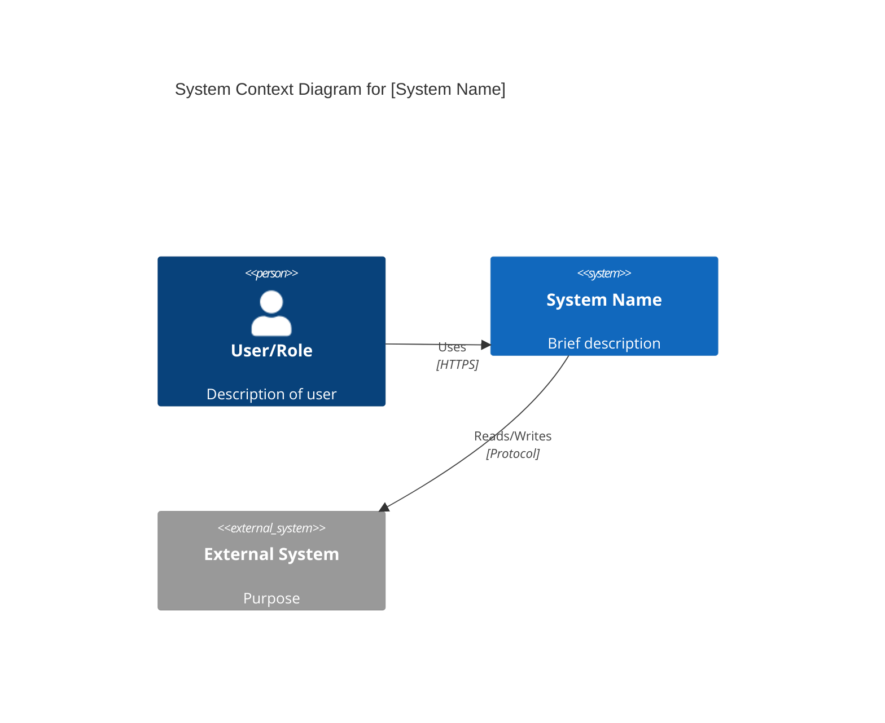
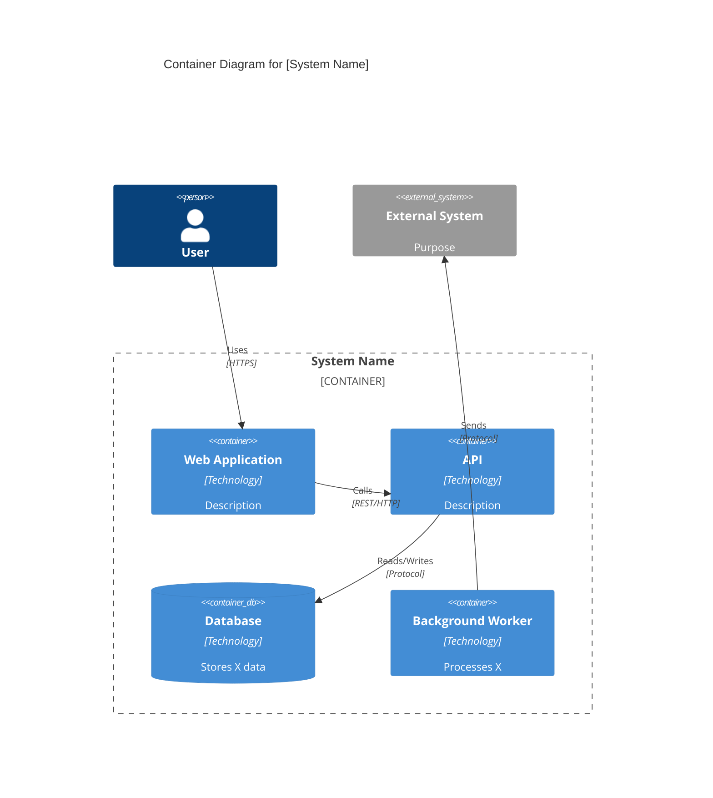
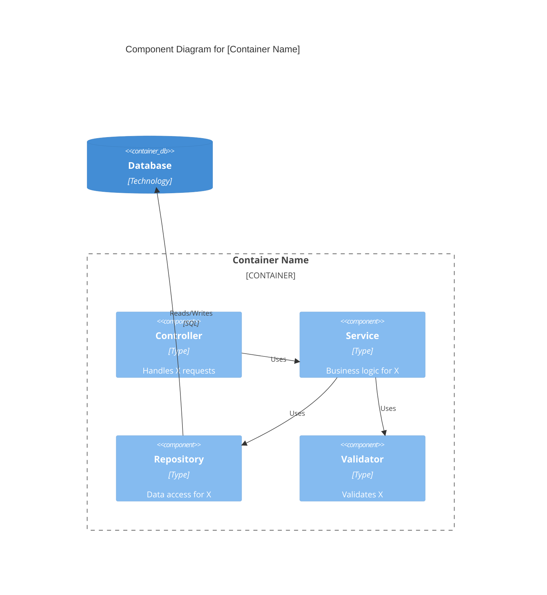
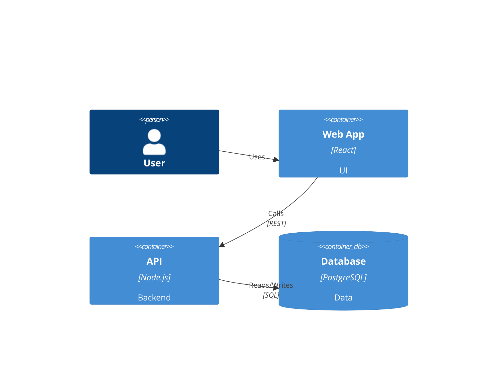
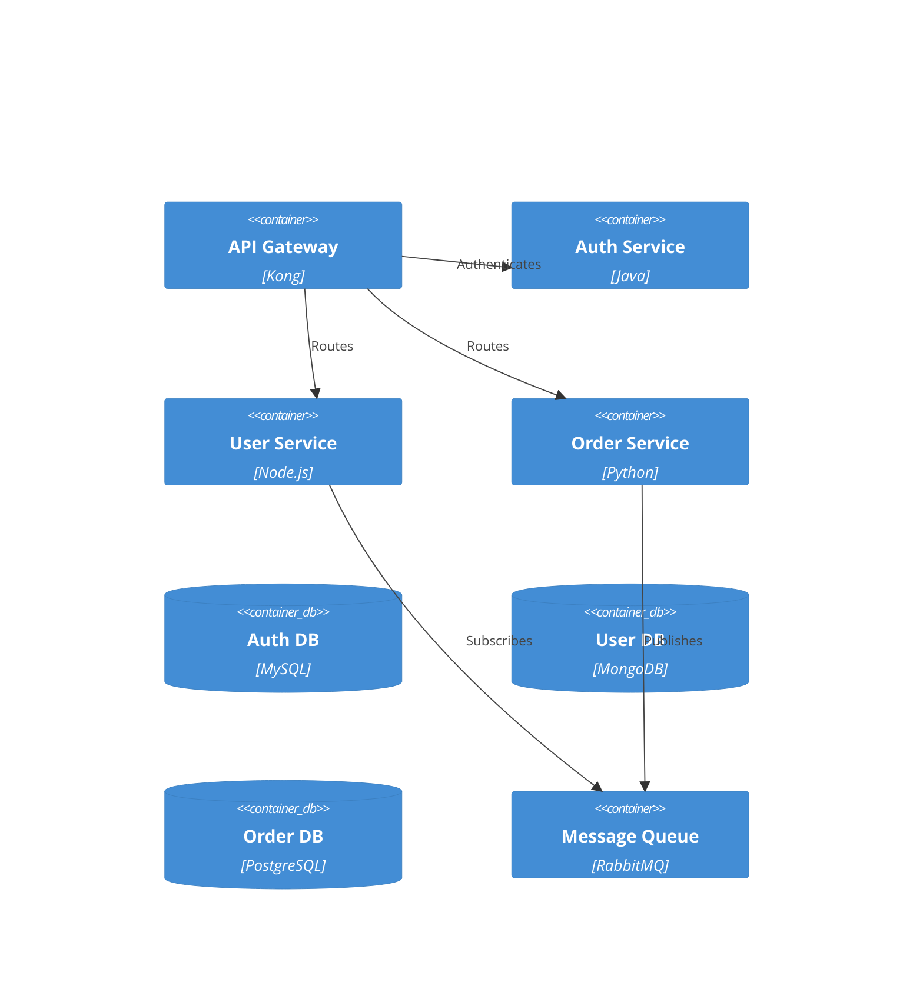

# AI-Enabled Software Development Lifecycle (SDLC)

## Overview

This document defines the development standards and practices for the eShopOnWeb modernization project, where Claude Code acts as the primary development executor. This is an AI-enabled SDLC that combines industry best practices with AI-specific workflows.

### Core Principles

1. **Test-Driven Development (TDD)** - All code changes must be driven by tests first
2. **London School TDD** - Use mockist/interaction-based testing with outside-in approach
3. **Gitflow Workflow** - Structured branching strategy for organized development
4. **Conventional Commits** - Standardized, semantic commit messages
5. **Professional PR Standards** - Clear, comprehensive pull request documentation
6. **Continuous Integration** - All tests must pass before merging
7. **Incremental Progress** - Small, focused changes over large rewrites

---

# Part 1: London TDD Methodology

## What is London TDD?

London TDD (also called "mockist" or "interaction-based" TDD) is a test-driven development approach that:

- **Tests behavior and interactions** rather than state
- **Uses mocks liberally** to isolate the unit under test
- **Works outside-in** from the entry point down to dependencies
- **Drives design** through collaboration and responsibility assignment
- **Creates focused unit tests** that test one class at a time

### London TDD vs. Classical TDD

| Aspect | London TDD | Classical TDD |
|--------|-----------|---------------|
| **Focus** | Behavior & interactions | State verification |
| **Mocking** | Heavy use of mocks/stubs | Minimal mocking, use real objects |
| **Isolation** | Each class tested in isolation | Integration at unit level |
| **Design approach** | Outside-in | Inside-out |
| **Test scope** | Single class responsibilities | Multiple classes together |

## The London TDD Cycle

### Red-Green-Refactor Loop

```
1. RED: Write a failing test
   ↓
2. GREEN: Write minimal code to make it pass
   ↓
3. REFACTOR: Clean up code while keeping tests green
   ↓
(Repeat)
```

### Detailed Workflow

#### 1. RED Phase - Write a Failing Test

**Before writing any production code:**

```csharp
// Example: Testing a service that processes orders
[Fact]
public void ProcessOrder_WhenOrderIsValid_ShouldCallPaymentGateway()
{
    // Arrange
    var paymentGateway = new Mock<IPaymentGateway>();
    var orderRepository = new Mock<IOrderRepository>();
    var orderService = new OrderService(paymentGateway.Object, orderRepository.Object);
    var order = new Order { Id = 1, Total = 100m };

    // Act
    orderService.ProcessOrder(order);

    // Assert
    paymentGateway.Verify(x => x.ProcessPayment(order.Total), Times.Once);
}
```

**Key points:**
- Test describes the **behavior** you want
- Dependencies are **mocked**
- Test **must fail** initially (run it to confirm!)
- Test name describes the scenario and expected outcome

#### 2. GREEN Phase - Make It Pass

Write the **minimum code** to make the test pass:

```csharp
public class OrderService
{
    private readonly IPaymentGateway _paymentGateway;
    private readonly IOrderRepository _orderRepository;

    public OrderService(IPaymentGateway paymentGateway, IOrderRepository orderRepository)
    {
        _paymentGateway = paymentGateway;
        _orderRepository = orderRepository;
    }

    public void ProcessOrder(Order order)
    {
        _paymentGateway.ProcessPayment(order.Total);
    }
}
```

**Key points:**
- Write **just enough** code
- Don't add extra features
- Get to green **quickly**

#### 3. REFACTOR Phase - Clean Up

Now improve the code while keeping tests green:

```csharp
public class OrderService
{
    private readonly IPaymentGateway _paymentGateway;
    private readonly IOrderRepository _orderRepository;

    public OrderService(IPaymentGateway paymentGateway, IOrderRepository orderRepository)
    {
        _paymentGateway = paymentGateway ?? throw new ArgumentNullException(nameof(paymentGateway));
        _orderRepository = orderRepository ?? throw new ArgumentNullException(nameof(orderRepository));
    }

    public void ProcessOrder(Order order)
    {
        if (order == null) throw new ArgumentNullException(nameof(order));

        _paymentGateway.ProcessPayment(order.Total);
    }
}
```

**Key points:**
- Add error handling
- Improve naming
- Extract methods
- Remove duplication
- Tests stay green throughout

## Outside-In Development

London TDD emphasizes **outside-in** development:

### The Outside-In Process

```
1. Start at the ENTRY POINT (Controller/API)
   ↓
2. Write test for high-level behavior
   ↓
3. Discover needed COLLABORATORS (Services, Repositories)
   ↓
4. Mock those collaborators
   ↓
5. Move to next layer IN
   ↓
6. Repeat until you reach infrastructure/data
```

### Example: Adding a Feature Outside-In

**Scenario:** Add "Apply Discount Code" feature

#### Layer 1: Controller/API (Outermost)

```csharp
// Test first
[Fact]
public void ApplyDiscount_WhenCodeIsValid_ReturnsDiscountedPrice()
{
    // Arrange
    var orderService = new Mock<IOrderService>();
    var controller = new OrderController(orderService.Object);
    orderService.Setup(x => x.ApplyDiscount("SAVE10", 100m))
               .Returns(90m);

    // Act
    var result = controller.ApplyDiscount(new DiscountRequest
    {
        Code = "SAVE10",
        Amount = 100m
    });

    // Assert
    Assert.Equal(90m, result.DiscountedAmount);
}
```

**This test discovers:** We need an `IOrderService.ApplyDiscount()` method

#### Layer 2: Service (Middle)

```csharp
// Test the service
[Fact]
public void ApplyDiscount_WhenCodeIsValid_CallsDiscountRepository()
{
    // Arrange
    var discountRepo = new Mock<IDiscountRepository>();
    var orderService = new OrderService(discountRepo.Object);
    discountRepo.Setup(x => x.GetByCode("SAVE10"))
               .Returns(new Discount { Code = "SAVE10", Percentage = 10 });

    // Act
    var result = orderService.ApplyDiscount("SAVE10", 100m);

    // Assert
    Assert.Equal(90m, result);
    discountRepo.Verify(x => x.GetByCode("SAVE10"), Times.Once);
}
```

**This test discovers:** We need a `IDiscountRepository.GetByCode()` method

#### Layer 3: Repository (Innermost)

```csharp
// Finally implement the actual repository
[Fact]
public void GetByCode_WhenCodeExists_ReturnsDiscount()
{
    // Arrange - use real database or integration test
    var context = new TestDbContext();
    context.Discounts.Add(new Discount { Code = "SAVE10", Percentage = 10 });
    context.SaveChanges();
    var repo = new DiscountRepository(context);

    // Act
    var result = repo.GetByCode("SAVE10");

    // Assert
    Assert.NotNull(result);
    Assert.Equal("SAVE10", result.Code);
}
```

### Benefits of Outside-In

✅ **Drives API design** from consumer perspective
✅ **Discovers interfaces naturally** as you need them
✅ **Keeps focus on user value** not implementation details
✅ **Creates cohesive design** with clear responsibilities

## London TDD Test Structure

### Arrange-Act-Assert (AAA) Pattern

**Always structure tests in three sections:**

```csharp
[Fact]
public void MethodName_Scenario_ExpectedBehavior()
{
    // Arrange - Set up test data and mocks
    var dependency = new Mock<IDependency>();
    var sut = new SystemUnderTest(dependency.Object);
    dependency.Setup(x => x.Method()).Returns(value);

    // Act - Execute the behavior
    var result = sut.MethodUnderTest();

    // Assert - Verify expectations
    Assert.Equal(expected, result);
    dependency.Verify(x => x.Method(), Times.Once);
}
```

### Test Naming Convention

**Format:** `MethodName_Scenario_ExpectedBehavior`

**Examples:**
- `ProcessOrder_WhenPaymentFails_ShouldThrowException`
- `GetUser_WhenUserExists_ShouldReturnUser`
- `CreateBasket_WhenUserIsAnonymous_ShouldCreateGuestBasket`
- `ApplyDiscount_WhenCodeIsExpired_ShouldReturnOriginalPrice`

### Mock Verification Patterns

**Verify method was called:**
```csharp
mock.Verify(x => x.Method(It.IsAny<int>()), Times.Once);
```

**Verify with specific parameters:**
```csharp
mock.Verify(x => x.Method(42), Times.Once);
```

**Verify method was never called:**
```csharp
mock.Verify(x => x.Method(), Times.Never);
```

**Verify property was set:**
```csharp
mock.VerifySet(x => x.Property = "value", Times.Once);
```

## Claude's London TDD Workflow

When implementing features, Claude Code MUST follow this process:

### Step 1: Create Test File First

Before touching production code:

```bash
# If implementing OrderService.ProcessOrder():
# First create: tests/OrderServiceTests.cs
```

### Step 2: Write Failing Test

```csharp
// Write test that describes desired behavior
[Fact]
public void ProcessOrder_WhenCalled_ShouldValidateOrder()
{
    var validator = new Mock<IOrderValidator>();
    var sut = new OrderService(validator.Object);
    var order = new Order();

    sut.ProcessOrder(order);

    validator.Verify(x => x.Validate(order), Times.Once);
}
```

### Step 3: Run Test (Confirm It Fails)

```bash
dotnet test
# Expected: Test fails because OrderService doesn't exist
```

### Step 4: Write Minimal Implementation

```csharp
public class OrderService
{
    private readonly IOrderValidator _validator;

    public OrderService(IOrderValidator validator)
    {
        _validator = validator;
    }

    public void ProcessOrder(Order order)
    {
        _validator.Validate(order);
    }
}
```

### Step 5: Run Test (Confirm It Passes)

```bash
dotnet test
# Expected: Test passes
```

### Step 6: Refactor If Needed

```csharp
public class OrderService
{
    private readonly IOrderValidator _validator;

    public OrderService(IOrderValidator validator)
    {
        _validator = validator ?? throw new ArgumentNullException(nameof(validator));
    }

    public void ProcessOrder(Order order)
    {
        if (order == null) throw new ArgumentNullException(nameof(order));

        _validator.Validate(order);
    }
}
```

### Step 7: Run Tests Again (Confirm Still Green)

```bash
dotnet test
# Expected: All tests still pass
```

### Step 8: Repeat for Next Behavior

Continue with next test case:
- `ProcessOrder_WhenValidationFails_ShouldThrowException`
- `ProcessOrder_WhenValid_ShouldSaveToRepository`
- etc.

## Test Organization

### Directory Structure

```
/src
  /Application
    /Services
      OrderService.cs
  /Domain
    /Entities
      Order.cs
/tests
  /Application.Tests
    /Services
      OrderServiceTests.cs
  /Domain.Tests
    /Entities
      OrderTests.cs
```

### Test Class Organization

```csharp
public class OrderServiceTests
{
    // Group related tests in nested classes
    public class ProcessOrderTests
    {
        [Fact]
        public void WhenOrderIsValid_ShouldProcessSuccessfully() { }

        [Fact]
        public void WhenOrderIsInvalid_ShouldThrowException() { }

        [Fact]
        public void WhenPaymentFails_ShouldNotSaveOrder() { }
    }

    public class CancelOrderTests
    {
        [Fact]
        public void WhenOrderIsPending_ShouldCancelSuccessfully() { }

        [Fact]
        public void WhenOrderIsShipped_ShouldThrowException() { }
    }
}
```

## Mocking Guidelines

### What to Mock

✅ **External dependencies** (databases, APIs, file system)
✅ **Services and repositories** in the layer below
✅ **Infrastructure concerns** (logging, caching, messaging)
✅ **Time-dependent operations** (DateTime.Now, timers)
✅ **Non-deterministic operations** (random number generators)

### What NOT to Mock

❌ **Value objects** (entities, DTOs, models)
❌ **Data structures** (lists, dictionaries)
❌ **Simple logic** (calculations, string operations)
❌ **Framework types you don't own** (use adapters instead)

### Example: Good vs. Bad Mocking

**❌ Over-mocking (Bad):**
```csharp
// Don't mock value objects
var order = new Mock<Order>();
var items = new Mock<List<OrderItem>>();
```

**✅ Proper mocking (Good):**
```csharp
// Mock services, use real value objects
var orderRepository = new Mock<IOrderRepository>();
var order = new Order { Items = new List<OrderItem>() };
```

## Common London TDD Patterns

### 1. Discovery Pattern

Let tests drive out interfaces:

```csharp
// Test reveals need for INotificationService
[Fact]
public void CompleteOrder_WhenSuccessful_ShouldNotifyCustomer()
{
    var notifier = new Mock<INotificationService>();
    var sut = new OrderService(notifier.Object);

    sut.CompleteOrder(order);

    notifier.Verify(x => x.NotifyCustomer(order.CustomerId), Times.Once);
}
```

### 2. Collaboration Pattern

Test how objects work together:

```csharp
[Fact]
public void ProcessPayment_WhenSuccessful_ShouldUpdateOrderAndNotify()
{
    var orderRepo = new Mock<IOrderRepository>();
    var notifier = new Mock<INotificationService>();
    var sut = new PaymentService(orderRepo.Object, notifier.Object);

    sut.ProcessPayment(payment);

    orderRepo.Verify(x => x.UpdateStatus(payment.OrderId, OrderStatus.Paid));
    notifier.Verify(x => x.SendReceipt(payment.OrderId));
}
```

### 3. Guard Clause Pattern

Test validation and error handling:

```csharp
[Fact]
public void ProcessOrder_WhenOrderIsNull_ShouldThrowArgumentNullException()
{
    var sut = new OrderService();

    var exception = Assert.Throws<ArgumentNullException>(() =>
        sut.ProcessOrder(null)
    );

    Assert.Equal("order", exception.ParamName);
}
```

## London TDD Checklist for Claude

Before committing any code, verify:

- [ ] Test written BEFORE implementation
- [ ] Test initially failed (RED)
- [ ] Minimal code written to pass (GREEN)
- [ ] Code refactored while keeping tests green (REFACTOR)
- [ ] All dependencies properly mocked
- [ ] Tests follow AAA pattern
- [ ] Test names follow convention: `Method_Scenario_Behavior`
- [ ] One assertion per test (or closely related assertions)
- [ ] Tests are isolated and can run in any order
- [ ] All tests pass
- [ ] Code coverage is maintained or improved

---

# Part 2: Gitflow Workflow

## Gitflow Overview

Gitflow is a branching model that provides a robust framework for managing larger projects. It assigns specific roles to different branches and defines how and when they should interact.

### Branch Types

| Branch Type | Purpose | Lifetime | Base Branch | Merge Target |
|-------------|---------|----------|-------------|--------------|
| `main` | Production-ready code | Permanent | N/A | N/A |
| `develop` | Integration branch for features | Permanent | `main` | `main` |
| `feature/*` | New features and enhancements | Temporary | `develop` | `develop` |
| `release/*` | Release preparation | Temporary | `develop` | `main` + `develop` |
| `hotfix/*` | Production bug fixes | Temporary | `main` | `main` + `develop` |

### Branch Naming Conventions

**Format:** `<type>/<short-description>`

**Feature branches:**
```
feature/add-discount-system
feature/user-authentication
feature/shopping-cart-persistence
```

**Release branches:**
```
release/v1.2.0
release/v2.0.0-beta
```

**Hotfix branches:**
```
hotfix/fix-payment-crash
hotfix/security-patch-auth
```

## The Gitflow Process

### 1. Feature Development

**Starting a new feature:**

```bash
# Ensure develop is up to date
git checkout develop
git pull origin develop

# Create feature branch
git checkout -b feature/add-discount-codes

# Work on feature with TDD
# (write test -> red -> green -> refactor -> commit)
```

**During development:**

```bash
# Commit regularly following TDD cycles
git add .
git commit -m "test: add test for discount code validation"

# Continue TDD cycle
git add .
git commit -m "feat: implement discount code validation"

# More TDD cycles
git add .
git commit -m "refactor: extract discount calculation to separate method"
```

**Completing the feature:**

```bash
# Ensure all tests pass
dotnet test

# Push feature branch
git push -u origin feature/add-discount-codes

# Create Pull Request (PR) to develop
# (Use GitHub/GitLab UI or gh CLI)
gh pr create --base develop --title "feat: Add discount code system" --body "..."
```

### 2. Release Process

**Starting a release:**

```bash
# Create release branch from develop
git checkout develop
git pull origin develop
git checkout -b release/v1.2.0

# Update version numbers
# Update CHANGELOG.md
git add .
git commit -m "chore: bump version to 1.2.0"

# Push release branch
git push -u origin release/v1.2.0
```

**Release preparation:**

```bash
# Only bug fixes allowed on release branch
git checkout release/v1.2.0

# Fix any release-blocking bugs
git add .
git commit -m "fix: correct price calculation in discount logic"

# When ready, merge to main
git checkout main
git merge --no-ff release/v1.2.0
git tag -a v1.2.0 -m "Release version 1.2.0"
git push origin main --tags

# Merge back to develop
git checkout develop
git merge --no-ff release/v1.2.0
git push origin develop

# Delete release branch
git branch -d release/v1.2.0
git push origin --delete release/v1.2.0
```

### 3. Hotfix Process

**Starting a hotfix:**

```bash
# Create hotfix from main
git checkout main
git pull origin main
git checkout -b hotfix/fix-payment-crash

# Fix the issue with TDD
# (write test -> make it pass -> commit)

git add .
git commit -m "fix: prevent null reference in payment processing"

# Merge to main
git checkout main
git merge --no-ff hotfix/fix-payment-crash
git tag -a v1.2.1 -m "Hotfix: payment crash"
git push origin main --tags

# Merge to develop
git checkout develop
git merge --no-ff hotfix/fix-payment-crash
git push origin develop

# Delete hotfix branch
git branch -d hotfix/fix-payment-crash
git push origin --delete hotfix/fix-payment-crash
```

## Claude's Gitflow Responsibilities

### When to Create Branches

Claude Code should create a new branch when:

1. **Starting a new feature** requested by the user
2. **Beginning a bug fix** that requires multiple commits
3. **Preparing a release** when instructed
4. **Addressing a production hotfix** when critical

### Branch Creation Rules

**✅ DO:**
- Create feature branches from `develop`
- Use descriptive branch names
- Include issue/ticket number if available: `feature/SHOP-123-add-wishlist`
- Keep branches focused on one feature/fix

**❌ DON'T:**
- Create branches from random commits
- Use vague names like `feature/updates` or `feature/fixes`
- Mix multiple unrelated features in one branch
- Leave branches unmerged for long periods

### Example Branch Creation Dialog

```bash
# User asks: "Add a wishlist feature to the shop"

# Claude's response:
# "I'll create a feature branch for the wishlist feature following Gitflow."

git checkout develop
git pull origin develop
git checkout -b feature/add-wishlist-functionality

# "Now I'll implement this feature using London TDD..."
```

## Merge Strategies

### Feature to Develop

**Use merge commits (--no-ff)** to preserve feature history:

```bash
git checkout develop
git merge --no-ff feature/add-discount-codes
git push origin develop
```

### Release/Hotfix to Main

**Use merge commits and tag:**

```bash
git checkout main
git merge --no-ff release/v1.2.0
git tag -a v1.2.0 -m "Release 1.2.0"
git push origin main --tags
```

### Keep Feature Branch Updated

**Rebase on develop** to keep feature branch current:

```bash
git checkout feature/add-discount-codes
git rebase develop
# Resolve conflicts if any
git push --force-with-lease origin feature/add-discount-codes
```

## Branch Protection Rules

For the modernization project, configure these protections:

### Main Branch
- ✅ Require pull request reviews
- ✅ Require status checks to pass (all tests)
- ✅ Require branches to be up to date
- ✅ Require signed commits
- ❌ Allow force pushes
- ❌ Allow deletions

### Develop Branch
- ✅ Require pull request reviews
- ✅ Require status checks to pass
- ✅ Require branches to be up to date
- ❌ Allow force pushes
- ❌ Allow deletions

---

# Part 3: Commit Message Standards

## Conventional Commits Specification

All commit messages MUST follow the [Conventional Commits](https://www.conventionalcommits.org/) specification.

### Format

```
<type>(<scope>): <subject>

<body>

<footer>
```

### Components

#### 1. Type (Required)

The type describes the category of change:

| Type | Description | When to Use |
|------|-------------|-------------|
| `feat` | New feature | Adding new functionality |
| `fix` | Bug fix | Fixing a bug |
| `docs` | Documentation | Updating documentation only |
| `style` | Code style | Formatting, missing semicolons, etc. |
| `refactor` | Code refactoring | Neither fixes bug nor adds feature |
| `test` | Tests | Adding or updating tests |
| `chore` | Maintenance | Build scripts, dependencies, etc. |
| `perf` | Performance | Performance improvements |
| `ci` | CI/CD | CI configuration changes |
| `build` | Build system | Build system or dependencies |
| `revert` | Revert | Reverting a previous commit |

#### 2. Scope (Optional)

The scope provides context about what part of the codebase is affected:

```
feat(basket): add ability to save basket for later
fix(payment): correct tax calculation for EU orders
test(catalog): add integration tests for product search
```

**Common scopes for eShopOnWeb:**
- `basket` - Shopping basket/cart
- `catalog` - Product catalog
- `order` - Order processing
- `payment` - Payment processing
- `auth` - Authentication/authorization
- `admin` - Admin functionality
- `api` - API layer
- `ui` - User interface
- `db` - Database

#### 3. Subject (Required)

- Use imperative mood: "add" not "added" or "adds"
- Don't capitalize first letter
- No period at the end
- Limit to 50 characters
- Complete the sentence: "If applied, this commit will..."

**✅ Good examples:**
```
add discount code validation
fix null reference in payment processor
update README with setup instructions
```

**❌ Bad examples:**
```
Added discount codes
Fixed bug
Updated stuff
```

#### 4. Body (Optional but Recommended)

- Separate from subject with a blank line
- Wrap at 72 characters
- Explain **what** and **why**, not **how**
- Use bullet points for multiple items

#### 5. Footer (Optional)

- Reference issues: `Closes #123`, `Fixes #456`
- Note breaking changes: `BREAKING CHANGE: ...`
- Co-authored commits: `Co-Authored-By: Claude <noreply@anthropic.com>`

### Complete Examples

#### Simple Commit (Type + Subject)

```
feat: add discount code validation
```

#### With Scope

```
feat(basket): add discount code validation
```

#### With Body

```
feat(basket): add discount code validation

Implement validation logic for discount codes including:
- Format validation (alphanumeric, 6-12 chars)
- Expiry date checking
- Usage limit verification
```

#### With Footer

```
fix(payment): correct tax calculation for EU orders

Tax was being calculated incorrectly for EU orders due to
incorrect VAT rate lookup. Now uses country-specific VAT
rates from configuration.

Fixes #234
```

#### Breaking Change

```
feat(api): change basket API to use GUIDs

BREAKING CHANGE: Basket IDs are now GUIDs instead of integers.
Clients must update to use the new ID format.

Migrates existing integer IDs to GUIDs via database migration.

Closes #567
```

#### Full Format Example

```
feat(catalog): add product search with filters

Implement advanced product search functionality:
- Full-text search across name and description
- Filter by category, price range, and brand
- Sort by relevance, price, and name
- Pagination support

Uses Elasticsearch for performant full-text search.
Includes comprehensive unit and integration tests.

Closes #123
Co-Authored-By: Claude <noreply@anthropic.com>
```

## London TDD Commit Pattern

When following London TDD, commits should reflect the Red-Green-Refactor cycle:

### Pattern 1: Test-First Commits

**Commit the test first:**
```
test(basket): add test for discount code validation

Tests that discount codes are validated for:
- Correct format (alphanumeric, 6-12 chars)
- Active status
- Expiry date
```

**Then commit the implementation:**
```
feat(basket): implement discount code validation

Validates discount codes according to business rules.
Uses DiscountCodeValidator with regex and date checks.
```

### Pattern 2: Refactor Commits

**After green, commit refactorings separately:**
```
refactor(basket): extract discount validation to separate class

Moves validation logic from BasketService to DiscountCodeValidator
for better separation of concerns and testability.
```

### Pattern 3: Combined Commits (Acceptable)

**For small changes, combine test + implementation:**
```
feat(basket): add discount code validation

Implement validation logic for discount codes with comprehensive
tests covering format, expiry, and usage limits.
```

## Claude's Commit Workflow

### Frequency

**Commit after each TDD cycle:**

1. ✅ Write test (RED)
2. ✅ Implement feature (GREEN)
3. ✅ **COMMIT**
4. ✅ Refactor if needed
5. ✅ **COMMIT** (if refactored)
6. Repeat

### Minimum Commit Frequency

- **At least one commit per test case**
- **Separate commits for refactorings**
- **Separate commits for test vs implementation** (when changes are significant)

### Example Commit Sequence

```bash
# Cycle 1: Add basic validation
git add tests/DiscountCodeValidatorTests.cs
git commit -m "test(basket): add test for discount code format validation"

git add src/DiscountCodeValidator.cs
git commit -m "feat(basket): implement discount code format validation"

# Cycle 2: Add expiry validation
git add tests/DiscountCodeValidatorTests.cs
git commit -m "test(basket): add test for discount code expiry validation"

git add src/DiscountCodeValidator.cs
git commit -m "feat(basket): implement discount code expiry validation"

# Cycle 3: Refactor
git add src/DiscountCodeValidator.cs
git commit -m "refactor(basket): extract validation rules to constants"

# Continue...
```

## Commit Message Quality Checklist

Before committing, verify:

- [ ] Type is appropriate (`feat`, `fix`, `test`, etc.)
- [ ] Scope is included (when applicable)
- [ ] Subject uses imperative mood
- [ ] Subject is ≤50 characters
- [ ] Subject doesn't end with a period
- [ ] Body explains what and why (not how)
- [ ] Body is wrapped at 72 characters
- [ ] Footer references issues (if applicable)
- [ ] Breaking changes are noted in footer
- [ ] Commit represents one logical change

---

# Part 4: Pull Request (PR) Standards

## PR Creation Guidelines

### When to Create a PR

Create a Pull Request when:

1. ✅ Feature branch is complete and all tests pass
2. ✅ Code has been refactored and cleaned up
3. ✅ Documentation has been updated (if needed)
4. ✅ You're ready for code review and merge

### PR Title Format

**Use Conventional Commit format for PR titles:**

```
<type>(<scope>): <description>
```

**Examples:**
```
feat(basket): Add discount code system
fix(payment): Correct tax calculation for EU orders
docs(api): Update API documentation for v2 endpoints
```

## PR Description Template

All PRs must include:

### 1. Summary

Brief description of what the PR does.

### 2. Changes Made

Bullet list of specific changes.

### 3. Testing Approach

Description of test strategy and coverage.

### 4. Related Issues

Links to related issues or tickets.

### 5. Checklist

Standard checklist items.

### Complete PR Template

```markdown
## Summary

Add discount code functionality to the basket system, allowing customers to apply promotional codes for discounts.

## Changes Made

- Implement `DiscountCodeValidator` for validating discount codes
- Add `DiscountCodeRepository` for retrieving discount codes from database
- Update `BasketService` to apply discounts when valid codes are provided
- Add comprehensive unit tests using London TDD approach
- Update basket API endpoint to accept discount codes
- Add database migration for discount codes table

## Testing Approach

### Unit Tests
- `DiscountCodeValidatorTests`: 12 tests covering all validation scenarios
- `BasketServiceTests`: 8 tests for discount application logic
- `DiscountCodeRepositoryTests`: 6 tests for data access

### Integration Tests
- `BasketApiTests`: 5 tests for end-to-end discount code application via API

### Test Coverage
- New code: 100% coverage
- Overall project: 87% coverage (+2%)

### Manual Testing
- [ ] Applied discount code via UI
- [ ] Verified expired codes are rejected
- [ ] Verified invalid codes show appropriate error
- [ ] Verified discount calculation is correct

## Type of Change

- [x] New feature (non-breaking change that adds functionality)
- [ ] Bug fix (non-breaking change that fixes an issue)
- [ ] Breaking change (fix or feature that would cause existing functionality to not work as expected)
- [ ] Documentation update
- [ ] Refactoring (no functional changes)
- [ ] Performance improvement
- [ ] Test improvements

## Development Process

- [x] Followed London TDD methodology (outside-in)
- [x] All tests written before implementation
- [x] Red-Green-Refactor cycle followed for each feature
- [x] Used mocks appropriately for dependencies

## Quality Checklist

- [x] Code follows project coding standards
- [x] All tests pass locally
- [x] New code has appropriate test coverage
- [x] No new warnings or errors introduced
- [x] Code has been refactored and is clean
- [x] Documentation updated (if applicable)
- [x] Database migrations included (if applicable)
- [x] No sensitive information committed (keys, passwords, etc.)

## Breaking Changes

None

## Database Migrations

```sql
CREATE TABLE DiscountCodes (
    Id INT PRIMARY KEY IDENTITY,
    Code NVARCHAR(50) NOT NULL,
    DiscountPercent DECIMAL(5,2) NOT NULL,
    ExpiryDate DATETIME NOT NULL,
    IsActive BIT NOT NULL DEFAULT 1
);
```

## Screenshots (if applicable)

N/A

## Related Issues

Closes #123
Related to #456

## Additional Notes

Discount codes are currently percentage-based only. Fixed-amount discounts will be added in a future PR.

## Reviewer Notes

Please pay special attention to:
- Discount calculation logic in `BasketService.ApplyDiscount()`
- Thread safety of discount code lookups
- Edge cases in `DiscountCodeValidator`

---

**Generated with AI assistance by Claude Code**

Co-Authored-By: Claude <noreply@anthropic.com>
```

## PR Quality Rubric

### Title (10 points)

| Score | Criteria |
|-------|----------|
| 10 | Follows Conventional Commits format, clear and descriptive |
| 7 | Mostly follows format, reasonably clear |
| 4 | Missing type/scope, vague description |
| 0 | Unclear or misleading title |

### Summary (15 points)

| Score | Criteria |
|-------|----------|
| 15 | Clear, concise summary of purpose and value |
| 10 | Adequate summary, some details missing |
| 5 | Vague or incomplete summary |
| 0 | No summary or completely unclear |

### Changes Made (15 points)

| Score | Criteria |
|-------|----------|
| 15 | Comprehensive bullet list of all significant changes |
| 10 | Most changes listed, some details missing |
| 5 | Incomplete list of changes |
| 0 | No list of changes |

### Testing Documentation (25 points)

| Score | Criteria |
|-------|----------|
| 25 | Complete test strategy, coverage metrics, test plan |
| 20 | Good test documentation, minor gaps |
| 15 | Basic test info, missing details |
| 10 | Minimal test information |
| 0 | No testing information |

### Checklist Completion (15 points)

| Score | Criteria |
|-------|----------|
| 15 | All checklist items completed |
| 10 | Most items completed |
| 5 | Some items incomplete |
| 0 | Checklist not used |

### Code Quality (20 points)

| Score | Criteria |
|-------|----------|
| 20 | Clean, well-tested code following all standards |
| 15 | Good code quality, minor issues |
| 10 | Acceptable quality, some issues |
| 5 | Poor quality, significant issues |
| 0 | Unacceptable code quality |

### Total Score: /100

**Passing Score:** 80/100

## Claude's PR Creation Process

### Step 1: Verify Readiness

Before creating PR, confirm:

```bash
# All tests pass
dotnet test

# Code builds successfully
dotnet build

# No uncommitted changes
git status

# Branch is up to date with develop
git fetch origin
git log origin/develop..HEAD
```

### Step 2: Push Branch

```bash
git push -u origin feature/add-discount-codes
```

### Step 3: Create PR

**Using GitHub CLI:**
```bash
gh pr create \
  --base develop \
  --title "feat(basket): Add discount code system" \
  --body-file .github/pull_request_template.md
```

**Then edit the PR description to fill in all sections.**

### Step 4: Request Review

Tag appropriate reviewers based on the changed areas.

### Step 5: Address Feedback

Make changes in response to review:

```bash
# Make requested changes
git add .
git commit -m "refactor: address PR review comments"
git push origin feature/add-discount-codes
```

## PR Review Process

### For Reviewers (When Applicable)

When reviewing PRs, check:

#### Code Quality
- [ ] Follows coding standards
- [ ] Proper error handling
- [ ] No code duplication
- [ ] Appropriate use of design patterns

#### Testing
- [ ] London TDD approach followed
- [ ] Tests are comprehensive
- [ ] Test names follow convention
- [ ] Mocks used appropriately
- [ ] Tests are isolated and deterministic

#### Architecture
- [ ] Follows existing patterns
- [ ] Dependencies are appropriate
- [ ] Interfaces properly defined
- [ ] Separation of concerns maintained

#### Documentation
- [ ] Code is self-documenting
- [ ] Complex logic has comments
- [ ] API documentation updated
- [ ] README updated if needed

#### Security
- [ ] No sensitive data exposed
- [ ] Input validation present
- [ ] SQL injection prevented
- [ ] XSS prevention in place

### Review Response Template

**Approving:**
```markdown
✅ **APPROVED**

Excellent work! The implementation follows London TDD principles perfectly,
tests are comprehensive, and the code is clean and well-structured.

**Highlights:**
- Great use of mocks to isolate the basket service
- Comprehensive edge case coverage
- Clear separation of concerns

**Minor suggestions:**
- Consider extracting magic numbers to constants
- Could add XML documentation to public methods

Approved for merge!
```

**Requesting Changes:**
```markdown
🔄 **CHANGES REQUESTED**

Good start, but a few issues need addressing before merge:

**Critical:**
1. Missing null check in `ApplyDiscount()` method
2. Test `ApplyDiscount_WhenCodeIsExpired_ShouldReturnError` is failing

**Important:**
1. `DiscountCodeValidator` should use dependency injection for date provider
2. Consider adding integration test for full discount flow

**Nice to have:**
1. Extract validation regex to constant
2. Add XML documentation

Please address critical items before next review.
```

---

# Part 5: Continuous Integration (CI)

## CI Pipeline Requirements

All branches must pass CI before merging. The CI pipeline should:

### 1. Build Verification

```yaml
- name: Build
  run: dotnet build --configuration Release
```

**Must succeed** - no compilation errors.

### 2. Unit Tests

```yaml
- name: Unit Tests
  run: dotnet test --filter Category=Unit --configuration Release
```

**Must succeed** - all unit tests pass.

### 3. Integration Tests

```yaml
- name: Integration Tests
  run: dotnet test --filter Category=Integration --configuration Release
```

**Must succeed** - all integration tests pass.

### 4. Code Coverage

```yaml
- name: Code Coverage
  run: |
    dotnet test /p:CollectCoverage=true /p:CoverletOutputFormat=opencover
    reportgenerator -reports:coverage.opencover.xml -targetdir:coverage
```

**Minimum threshold:** 80% coverage

### 5. Code Quality Analysis

```yaml
- name: Code Analysis
  run: dotnet format --verify-no-changes
```

**Must succeed** - code follows formatting standards.

### 6. Security Scanning

```yaml
- name: Security Scan
  run: dotnet list package --vulnerable --include-transitive
```

**Must succeed** - no known vulnerabilities.

## CI Status Checks

### Required Checks for Merge

- ✅ Build successful
- ✅ All unit tests pass
- ✅ All integration tests pass
- ✅ Code coverage ≥80%
- ✅ Code analysis passes
- ✅ No security vulnerabilities
- ✅ At least one approving review

### Example GitHub Actions Workflow

```yaml
name: CI

on:
  pull_request:
    branches: [ develop, main ]
  push:
    branches: [ develop, main ]

jobs:
  build-and-test:
    runs-on: ubuntu-latest

    steps:
    - uses: actions/checkout@v3

    - name: Setup .NET
      uses: actions/setup-dotnet@v3
      with:
        dotnet-version: '8.0.x'

    - name: Restore dependencies
      run: dotnet restore

    - name: Build
      run: dotnet build --no-restore --configuration Release

    - name: Unit Tests
      run: dotnet test --no-build --configuration Release --filter Category=Unit

    - name: Integration Tests
      run: dotnet test --no-build --configuration Release --filter Category=Integration

    - name: Code Coverage
      run: |
        dotnet test --no-build --configuration Release \
          /p:CollectCoverage=true \
          /p:CoverletOutputFormat=opencover \
          /p:Threshold=80

    - name: Code Analysis
      run: dotnet format --verify-no-changes --no-restore

    - name: Security Scan
      run: dotnet list package --vulnerable --include-transitive
```

---

# Part 6: AI-Specific SDLC Guidelines

## Claude Code's Development Workflow

### Complete Feature Development Flow

```
1. USER REQUEST
   ↓
2. UNDERSTAND REQUIREMENTS
   - Ask clarifying questions if needed
   - Confirm approach
   ↓
3. CREATE FEATURE BRANCH
   git checkout -b feature/feature-name
   ↓
4. LONDON TDD CYCLE (repeat for each behavior)
   ├─ Write failing test (RED)
   ├─ Run test to confirm it fails
   ├─ Write minimal implementation (GREEN)
   ├─ Run test to confirm it passes
   ├─ Commit (test + implementation)
   ├─ Refactor if needed
   ├─ Run tests to confirm still green
   └─ Commit refactoring
   ↓
5. VERIFY QUALITY
   - All tests pass
   - Code coverage maintained
   - No warnings or errors
   ↓
6. CREATE PULL REQUEST
   - Write comprehensive PR description
   - Include test summary
   - Complete checklist
   ↓
7. ADDRESS REVIEW FEEDBACK
   - Make requested changes
   - Update tests if needed
   - Push updates
   ↓
8. MERGE
   - Squash or merge based on project preference
   - Delete feature branch
```

### Decision Points for Claude

#### When to Ask the User

Ask the user when:

1. **Requirements are ambiguous**
   ```
   "Should discount codes be case-sensitive or case-insensitive?"
   ```

2. **Multiple valid approaches exist**
   ```
   "I can implement this using either:
   A) Event-driven architecture with message queue
   B) Direct database updates with transactions
   Which approach do you prefer?"
   ```

3. **Breaking changes are necessary**
   ```
   "This fix requires changing the public API, which is a breaking change.
   Should I proceed or look for a backward-compatible solution?"
   ```

4. **Trade-offs need human judgment**
   ```
   "I can optimize for performance (more complex code) or
   simplicity (slower execution). Which is more important?"
   ```

#### When to Proceed Autonomously

Proceed without asking when:

1. **Following established patterns** in the codebase
2. **Implementing standard CRUD operations**
3. **Writing tests** (always do this first!)
4. **Refactoring** to improve code quality
5. **Fixing obvious bugs**
6. **Following explicit instructions** from CLAUDE.md

### Communication Style

#### Progress Updates

Provide updates at key milestones:

```markdown
"I'll implement the discount code feature using London TDD. Here's my plan:

1. Start with the API controller test (outside-in)
2. Work down to the service layer
3. Implement the repository layer
4. Add integration tests

I'll create a feature branch: feature/add-discount-codes

Starting now..."
```

#### Test Results

Share test results after each cycle:

```markdown
"✅ Test passed: ApplyDiscount_WhenCodeIsValid_ShouldReducePrice

Moving to next test case: ApplyDiscount_WhenCodeIsExpired_ShouldReturnError"
```

#### Completion Summary

Summarize when done:

```markdown
"✅ Feature complete: Discount code system

**Implemented:**
- Discount code validation
- Discount application logic
- API endpoints
- Database repository

**Tests:**
- 12 unit tests (all passing)
- 5 integration tests (all passing)
- Coverage: 95%

**Next steps:**
Ready to create PR to develop branch. Should I proceed?"
```

### Error Handling

#### When Tests Fail

```markdown
"❌ Test failed: ApplyDiscount_WhenCodeIsExpired_ShouldReturnError

**Error:** Expected exception was not thrown

**Analysis:** The expiry date check is missing from the validator.

**Fix:** Adding expiry date validation to DiscountCodeValidator.Validate()

Retrying..."
```

#### When Blocked

```markdown
"⚠️ Blocked: Need clarification

I discovered that discount codes can be either percentage-based or fixed-amount,
but the current design only supports percentages.

Should I:
A) Extend the design to support both types (larger change)
B) Document the limitation and continue with percentage-only (quicker)
C) Something else?
```

### Commit Message Generation

Claude automatically generates commit messages following the standards:

```markdown
"Committing changes:

test(basket): add test for discount code expiry validation

Tests that expired discount codes are properly rejected
and appropriate error message is returned.
"
```

### PR Description Generation

Claude automatically generates comprehensive PR descriptions:

```markdown
"Creating Pull Request:

Title: feat(basket): Add discount code system

[Shows full PR template filled out with all details]

Should I create this PR to the develop branch?"
```

## Quality Gates

### Before Every Commit

- [ ] Tests written first (RED)
- [ ] Implementation added (GREEN)
- [ ] Tests pass
- [ ] Code refactored if needed
- [ ] Tests still pass after refactoring
- [ ] Commit message follows Conventional Commits

### Before Every Push

- [ ] All tests pass locally
- [ ] Code builds without warnings
- [ ] No debugging code left in
- [ ] No commented-out code
- [ ] No TODOs without issue references

### Before Every PR

- [ ] Feature branch is up to date with develop
- [ ] All tests pass
- [ ] Code coverage maintained or improved
- [ ] PR description is complete
- [ ] All checklist items checked
- [ ] No merge conflicts

### Before Every Merge

- [ ] PR approved by reviewer(s)
- [ ] All CI checks pass
- [ ] No unresolved conversations
- [ ] Branch is up to date with target
- [ ] Merge strategy follows project standards

---

# Part 7: Quick Reference

## TDD Cycle Quick Reference

```
1. RED    - Write failing test
2. GREEN  - Minimal code to pass
3. REFACTOR - Improve while staying green
4. COMMIT - Save progress
5. REPEAT
```

## Commit Type Quick Reference

```
feat     - New feature
fix      - Bug fix
test     - Test changes
refactor - Code restructuring
docs     - Documentation
style    - Formatting
chore    - Maintenance
perf     - Performance
ci       - CI/CD changes
build    - Build system
revert   - Revert previous commit
```

## Branch Naming Quick Reference

```
feature/short-description   - New features
hotfix/short-description    - Production fixes
release/v1.2.3              - Release preparation
```

## Git Commands Quick Reference

```bash
# Start feature
git checkout develop
git pull origin develop
git checkout -b feature/my-feature

# Regular commits
git add .
git commit -m "type(scope): description"

# Push feature
git push -u origin feature/my-feature

# Create PR (GitHub CLI)
gh pr create --base develop --title "feat: description"

# Update feature branch
git checkout feature/my-feature
git rebase develop

# Complete feature
git checkout develop
git merge --no-ff feature/my-feature
git push origin develop
git branch -d feature/my-feature
```

## Test Naming Quick Reference

```
MethodName_Scenario_ExpectedBehavior

Examples:
ProcessOrder_WhenPaymentFails_ShouldThrowException
GetUser_WhenUserExists_ShouldReturnUser
ApplyDiscount_WhenCodeIsExpired_ShouldReturnOriginalPrice
```

## AAA Pattern Quick Reference

```csharp
[Fact]
public void Method_Scenario_Behavior()
{
    // Arrange - Setup
    var mock = new Mock<IDependency>();
    var sut = new SystemUnderTest(mock.Object);

    // Act - Execute
    var result = sut.Method();

    // Assert - Verify
    Assert.Equal(expected, result);
    mock.Verify(x => x.Method(), Times.Once);
}
```

---

# Summary: AI-Enabled SDLC for eShopOnWeb Modernization

This SDLC ensures that Claude Code operates as a professional development team member, following industry best practices while leveraging AI capabilities for efficient, high-quality development.

## Core Principles Recap

1. **Test First, Always** - No production code without tests
2. **Small Commits, Often** - Commit after each TDD cycle
3. **Clear Communication** - Explain what you're doing and why
4. **Follow Standards** - Conventional commits, gitflow, proper PRs
5. **Quality Gates** - Multiple verification points before merge
6. **Transparency** - Share test results, blockers, and progress

## Success Metrics

The modernization project is successful when:

✅ **Test Coverage** ≥80% across all new/modified code
✅ **All Tests Pass** - No red tests in any branch
✅ **Commit Standards** - 100% of commits follow Conventional Commits
✅ **PR Quality** - All PRs score ≥80 on quality rubric
✅ **CI/CD** - All builds pass all quality gates
✅ **Documentation** - Code is self-documenting with clear tests
✅ **Branch Hygiene** - Gitflow followed consistently

---

---

# Architecture Documentation & Extraction Guide

## Purpose
This guide directs Claude to analyze undocumented or poorly documented codebases and extract comprehensive architectural information, producing professional documentation including C4 diagrams, technical specifications, and solution architecture artifacts.

## Core Objectives

1. **Reverse-engineer architecture** from existing code
2. **Generate C4 model diagrams** (Context, Container, Component, Code)
3. **Document technical and solution architecture**
4. **Establish documentation standards** for the project
5. **Create maintainable, professional artifacts**

---

## Analysis Approach

### Phase 1: Repository Discovery & Inventory

When analyzing a codebase, systematically explore:

1. **Entry Points & Structure**
   - Main application files (main.py, index.js, Program.cs, etc.)
   - Configuration files (package.json, pom.xml, .env templates, docker-compose.yml)
   - Documentation files (README, CHANGELOG, /docs folder)
   - Build and deployment scripts

2. **Technology Stack Identification**
   - Programming languages and versions
   - Frameworks and libraries (check dependency files)
   - Databases and data stores
   - External services and APIs
   - Infrastructure components (Docker, K8s, cloud resources)

3. **Code Organization Patterns**
   - Project structure and module organization
   - Architectural patterns (MVC, microservices, layered, event-driven, etc.)
   - Design patterns in use
   - Separation of concerns

4. **Integration Points**
   - External API calls
   - Message queues and event buses
   - Database connections
   - Authentication/authorization mechanisms
   - Third-party service integrations

### Phase 2: Deep Analysis

Examine the codebase for:

1. **Data Flow & Processing**
   - How data enters the system
   - Transformation and processing steps
   - Data persistence strategies
   - Caching mechanisms

2. **Business Logic & Domain Model**
   - Core domain concepts and entities
   - Business rules and workflows
   - State management
   - Validation and business constraints

3. **Cross-Cutting Concerns**
   - Logging and monitoring
   - Error handling and resilience patterns
   - Security implementations
   - Performance optimizations

4. **Deployment & Infrastructure**
   - Deployment configurations
   - Environment management
   - Scalability considerations
   - Monitoring and observability setup

---

## C4 Model Documentation

Generate comprehensive C4 diagrams using Mermaid syntax. Create separate artifacts for each level.

### Level 1: System Context Diagram

**Purpose**: Show the system in the context of users and external systems.

**Elements to identify**:
- The system being documented (central box)
- Users/actors (people or roles)
- External systems the application interacts with
- High-level relationships and data flows

**Mermaid Template**:


### Level 2: Container Diagram

**Purpose**: Show high-level technology choices and how containers communicate.

**Containers are**:
- Web applications
- Mobile apps
- Desktop applications
- Databases
- File systems
- Microservices
- Serverless functions

**Mermaid Template**:


### Level 3: Component Diagram

**Purpose**: Decompose containers into components showing responsibilities.

**Components are**:
- Controllers/Handlers
- Services/Business Logic
- Repositories/Data Access
- Utilities/Helpers
- Middleware

**Mermaid Template**:


### Level 4: Code Diagram

**Purpose**: Show implementation details for specific components (UML class diagrams).

Use when additional detail is valuable for complex components. Can be represented with Mermaid class diagrams.

---

## Documentation Artifacts to Generate

### 1. Architecture Decision Records (ADRs)

For each significant architectural decision inferred from the code:

```markdown
# ADR-[NUMBER]: [Title]

## Status
[Proposed/Accepted/Deprecated/Superseded]

## Context
What is the issue we're trying to solve?

## Decision
What decision was made? (Inferred from implementation)

## Consequences
- Positive consequences
- Negative consequences
- Trade-offs made
```

### 2. System Overview Document

```markdown
# System Architecture Overview

## Executive Summary
Brief description of what the system does and its primary purpose.

## Architecture Style
- Overall architecture pattern (monolithic, microservices, serverless, etc.)
- Justification based on observed patterns

## Key Components
High-level breakdown of major components.

## Technology Stack
- Frontend: [Technologies]
- Backend: [Technologies]
- Data: [Technologies]
- Infrastructure: [Technologies]
- DevOps: [Technologies]

## Quality Attributes
- Performance characteristics
- Scalability approach
- Security measures
- Reliability/resilience patterns
```

### 3. Technical Architecture Document

```markdown
# Technical Architecture

## System Decomposition
Detailed breakdown of system components.

## Data Architecture
- Data models and schemas
- Data flow diagrams
- Storage strategies
- Caching strategies

## Integration Architecture
- External system integrations
- API contracts
- Message formats
- Authentication/authorization

## Infrastructure Architecture
- Deployment model
- Network topology
- Scaling strategy
- Disaster recovery

## Security Architecture
- Authentication mechanisms
- Authorization model
- Data protection
- Security controls
```

### 4. Component Catalog

```markdown
# Component Catalog

## [Component Name]

**Purpose**: What this component does

**Responsibilities**:
- Responsibility 1
- Responsibility 2

**Dependencies**:
- Internal: Components it depends on
- External: Third-party libraries/services

**Interfaces**:
- Public APIs/methods exposed
- Events published/consumed

**Data**: Data it owns or manages

**Notes**: Implementation details, patterns used
```

### 5. Data Dictionary

```markdown
# Data Dictionary

## [Entity/Table Name]

**Purpose**: Description of what this data represents

**Attributes**:
| Field | Type | Required | Description | Constraints |
|-------|------|----------|-------------|-------------|
| id | int | Yes | Unique identifier | Primary key |

**Relationships**:
- Related to [Entity] via [relationship]

**Indexes**: Performance indexes

**Notes**: Important implementation details
```

### 6. API Documentation

```markdown
# API Documentation

## Endpoint: [HTTP Method] [Path]

**Purpose**: What this endpoint does

**Authentication**: Requirements

**Request**:
- Headers
- Path parameters
- Query parameters
- Body schema

**Response**:
- Success (200): Schema
- Error cases: Status codes and schemas

**Example**:
```json
{
  "example": "request/response"
}
```

**Notes**: Implementation details, rate limits, etc.
```

### 7. Deployment Guide

```markdown
# Deployment Architecture

## Environments
- Development
- Staging
- Production

## Infrastructure Components
- Servers/compute
- Load balancers
- Databases
- Cache layers
- Message queues
- Storage

## Deployment Process
Step-by-step deployment procedure inferred from scripts and configuration.

## Configuration Management
Environment variables, secrets, feature flags.

## Monitoring & Observability
- Logging
- Metrics
- Alerting
- Tracing
```

---

## Documentation Quality Rubric

Use this rubric to evaluate and ensure high-quality documentation output.

### Completeness (25 points)

| Score | Criteria |
|-------|----------|
| 25 | All architecture levels documented (Context, Container, Component). All major components cataloged. Complete data models. Full integration points mapped. |
| 20 | Most architecture levels documented. Key components cataloged. Major data models present. Primary integrations mapped. |
| 15 | Basic architecture documented. Main components identified. Core data models present. |
| 10 | Minimal architecture documented. Some components identified. |
| 5 | Incomplete documentation with significant gaps. |

### Accuracy (25 points)

| Score | Criteria |
|-------|----------|
| 25 | All diagrams accurately reflect codebase. Technology stack correctly identified. Relationships and dependencies verified against code. |
| 20 | Diagrams mostly accurate with minor discrepancies. Technology stack correct. Most relationships verified. |
| 15 | Generally accurate with some errors. Core architecture correct. |
| 10 | Multiple inaccuracies. Some guesswork without verification. |
| 5 | Significant errors or misrepresentations. |

### Clarity (20 points)

| Score | Criteria |
|-------|----------|
| 20 | Crystal clear explanations. Consistent terminology. Appropriate detail level for audience. Diagrams are intuitive and well-labeled. |
| 16 | Clear explanations. Mostly consistent terminology. Appropriate detail. |
| 12 | Understandable but could be clearer. Some terminology inconsistencies. |
| 8 | Confusing in places. Inconsistent terminology. |
| 4 | Difficult to understand. Poor organization. |

### Professional Quality (15 points)

| Score | Criteria |
|-------|----------|
| 15 | Publication-ready. Consistent formatting. No typos. Professional diagrams. Follows documentation standards. |
| 12 | High quality. Minor formatting issues. Professional appearance. |
| 9 | Good quality. Some formatting inconsistencies. |
| 6 | Acceptable but unprofessional in places. |
| 3 | Poor quality. Many issues. |

### Usefulness (15 points)

| Score | Criteria |
|-------|----------|
| 15 | Immediately actionable. New team members could onboard with this. Answers all key questions. Provides context and rationale. |
| 12 | Very useful. Could onboard with minor additional info. Answers most questions. |
| 9 | Useful as reference. Some gaps for onboarding. |
| 6 | Limited usefulness. Significant gaps. |
| 3 | Minimally useful. Too many gaps. |

### Total Score: /100

**Grade Scale**:
- 90-100: Excellent
- 80-89: Good
- 70-79: Satisfactory
- 60-69: Needs Improvement
- Below 60: Unacceptable

---

## Workflow Instructions for Claude

When asked to analyze a repository and extract architecture:

1. **Initial Scan** (5-10 minutes)
   - Map directory structure
   - Identify entry points
   - List configuration files
   - Note technology stack

2. **Component Analysis** (15-20 minutes)
   - Examine main application code
   - Identify major components/modules
   - Map dependencies
   - Note design patterns

3. **Integration Analysis** (10-15 minutes)
   - Find external service calls
   - Identify database interactions
   - Map API endpoints
   - Note authentication flows

4. **Documentation Generation** (20-30 minutes)
   - Create C4 Context diagram
   - Create C4 Container diagram
   - Create C4 Component diagrams for key containers
   - Write System Overview
   - Write Technical Architecture
   - Create Component Catalog
   - Document APIs
   - Create Data Dictionary

5. **Review & Refinement** (10 minutes)
   - Verify accuracy against code
   - Ensure consistency
   - Check for completeness
   - Apply rubric scoring

### Output Format

Provide documentation as:
1. **Executive Summary** - 1 page overview
2. **Architecture Diagrams** - Separate Mermaid artifacts for each C4 level
3. **Technical Documentation** - Markdown documents for detailed architecture
4. **Component Catalog** - Reference documentation
5. **Self-Assessment** - Rubric scoring with justification

### Best Practices

- **Be Visual**: Prefer diagrams over text where possible
- **Be Specific**: Reference actual file names, class names, and technologies
- **Be Honest**: Note assumptions and areas of uncertainty
- **Be Structured**: Use consistent formatting and organization
- **Be Concise**: Avoid unnecessary verbosity
- **Be Actionable**: Documentation should enable decision-making

### Questions to Answer

Your analysis should answer:
- What does this system do?
- How is it structured?
- What technologies are used and why?
- How do components communicate?
- Where is data stored and how is it accessed?
- What are the external dependencies?
- How is it deployed?
- What are the key architectural decisions?
- What are the quality attributes (performance, security, scalability)?
- Where are the risks and technical debt?

---

## Example Analysis Output Structure

```
/architecture-docs/
├── README.md (Executive Summary)
├── diagrams/
│   ├── c4-context.mermaid
│   ├── c4-container.mermaid
│   ├── c4-component-api.mermaid
│   ├── c4-component-web.mermaid
│   └── data-flow.mermaid
├── architecture/
│   ├── system-overview.md
│   ├── technical-architecture.md
│   ├── solution-architecture.md
│   └── deployment-architecture.md
├── reference/
│   ├── component-catalog.md
│   ├── api-documentation.md
│   ├── data-dictionary.md
│   └── technology-stack.md
└── decisions/
    ├── adr-001-architecture-style.md
    ├── adr-002-database-choice.md
    └── adr-003-api-design.md
```

---

## Mermaid Diagram Best Practices

### General Guidelines
- Keep diagrams focused on one level of abstraction
- Use consistent naming conventions
- Add descriptions that add value
- Limit elements to 7-10 per diagram for readability
- Use boundaries to group related elements
- Choose appropriate relationships (uses, reads, writes, calls, sends)

### Styling Recommendations
```mermaid
%%{init: {'theme':'base', 'themeVariables': { 'primaryColor':'#1168bd','primaryTextColor':'#fff'}}}%%
```

### Common Patterns

**Web Application with Database**:


**Microservices Architecture**:


---

## Advanced Analysis Techniques

### Pattern Recognition

Look for common patterns in the code:

1. **Architectural Patterns**
   - Layered/N-tier (presentation, business, data layers)
   - Microservices (independent deployable services)
   - Event-driven (message queues, event sourcing)
   - CQRS (command query responsibility segregation)
   - Hexagonal/Clean Architecture (ports and adapters)

2. **Design Patterns**
   - Repository pattern (data access abstraction)
   - Factory pattern (object creation)
   - Strategy pattern (algorithm selection)
   - Observer pattern (event handling)
   - Dependency Injection (loose coupling)

3. **Integration Patterns**
   - REST APIs
   - GraphQL
   - Message queues
   - Event streaming
   - Service mesh

### Inference Techniques

When documentation is missing:

1. **Technology Stack**: Check package/dependency files first
2. **Architecture Style**: Examine project structure and module organization
3. **Data Models**: Analyze database migrations or ORM models
4. **API Contracts**: Look at routing files and controller signatures
5. **Business Logic**: Examine service layer and domain models
6. **Deployment**: Check Dockerfile, docker-compose, K8s manifests, CI/CD configs

### Validation Methods

- Cross-reference findings across multiple files
- Trace data flow from entry to storage
- Verify relationships by examining import/require statements
- Test inferences against actual code implementations
- Note confidence level for assumptions

---

## Handling Common Challenges

### Challenge: Large Codebase
**Solution**: Focus on main flows first, then expand. Create multiple component diagrams instead of one large diagram.

### Challenge: Mixed Patterns
**Solution**: Document the actual patterns used, note inconsistencies, recommend standardization.

### Challenge: Legacy Code
**Solution**: Document "as-is" architecture, note technical debt, suggest modernization paths.

### Challenge: Microservices Complexity
**Solution**: Create separate container diagrams for each service, plus an overall context diagram.

### Challenge: Poor Code Organization
**Solution**: Infer logical architecture from code execution flow, recommend restructuring.

### Challenge: Missing Configuration
**Solution**: Document what's found, note missing pieces, recommend configuration documentation.

---

## Success Criteria

Your documentation extraction is successful when:

✅ A new developer can understand the system in 1-2 hours
✅ All major components are identified and explained
✅ Technology choices are clear
✅ Integration points are mapped
✅ Data flows are documented
✅ Deployment process is understood
✅ Diagrams accurately reflect implementation
✅ Documentation scores 80+ on the rubric
✅ No major architectural elements are missing
✅ Assumptions are clearly stated

---

## Quick Reference: C4 Element Types

### Context Diagram
- `Person()` - User or actor
- `System()` - System being documented
- `System_Ext()` - External system
- `Rel()` - Relationship

### Container Diagram
- `Container()` - Application, service, or process
- `ContainerDb()` - Database
- `ContainerQueue()` - Message queue
- `Container_Boundary()` - Grouping
- `System_Ext()` - External system

### Component Diagram
- `Component()` - Code component
- `ComponentDb()` - Database
- `ComponentQueue()` - Queue
- `Component_Boundary()` - Container boundary

### Relationships
- `Rel()` - Generic relationship
- `Rel_Back()` - Reverse relationship
- `BiRel()` - Bidirectional relationship
- Parameters: (from, to, label, technology)

---

## Remember

- **Documentation is a living artifact** - it should evolve with the code
- **Accuracy over completeness** - correct information about core components is better than incomplete information about everything
- **Audience matters** - adjust technical depth based on who will read the documentation
- **Visual > Text** - a good diagram communicates faster than paragraphs
- **Context is king** - always explain the "why" behind architectural decisions

When in doubt, examine the code more deeply rather than making assumptions.
