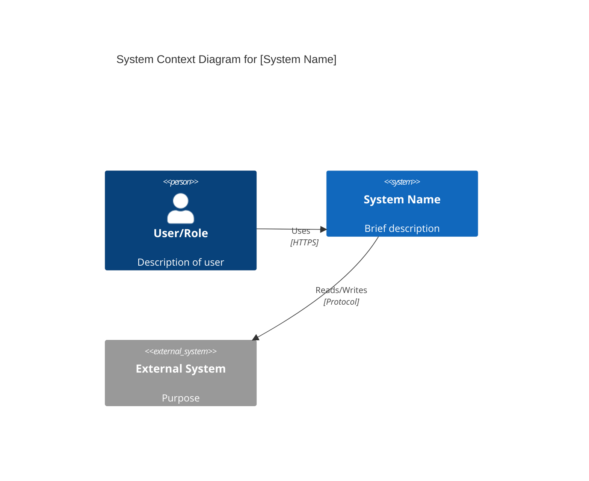
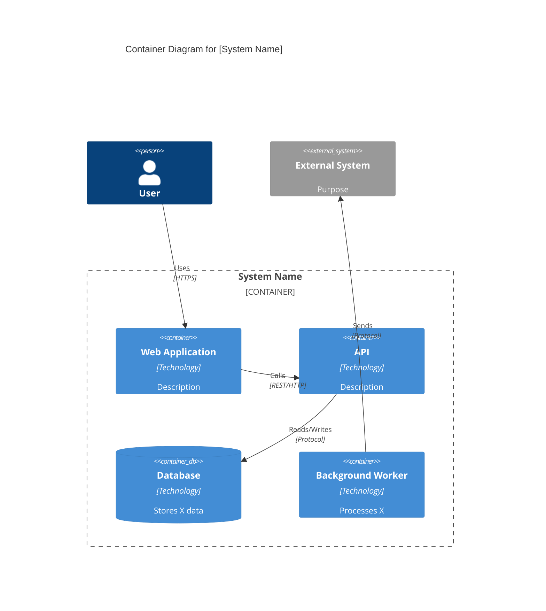
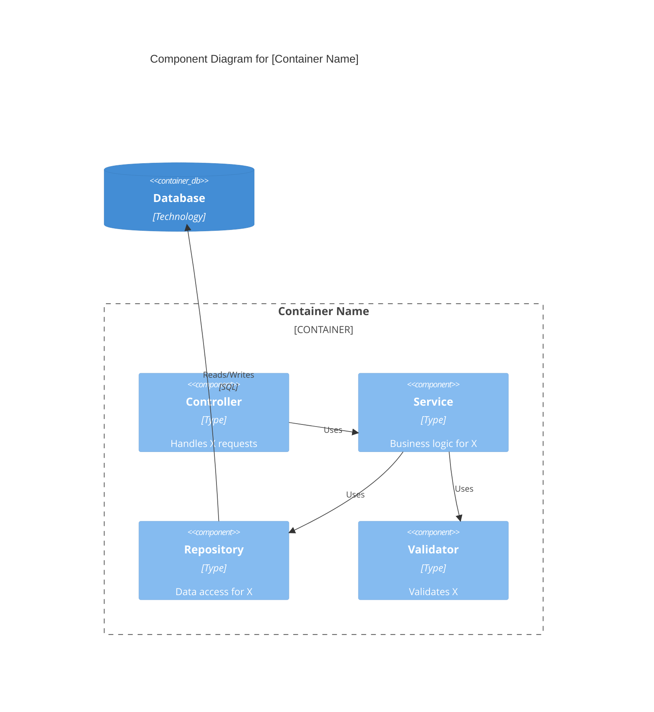
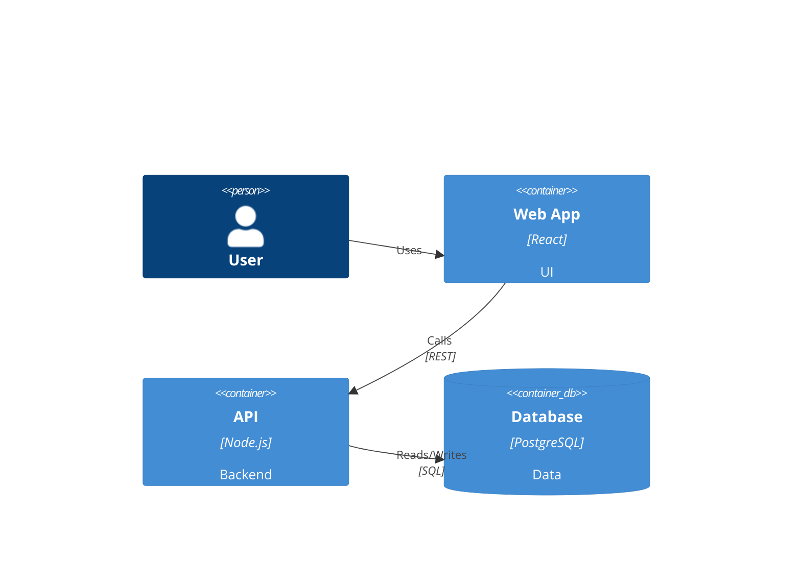
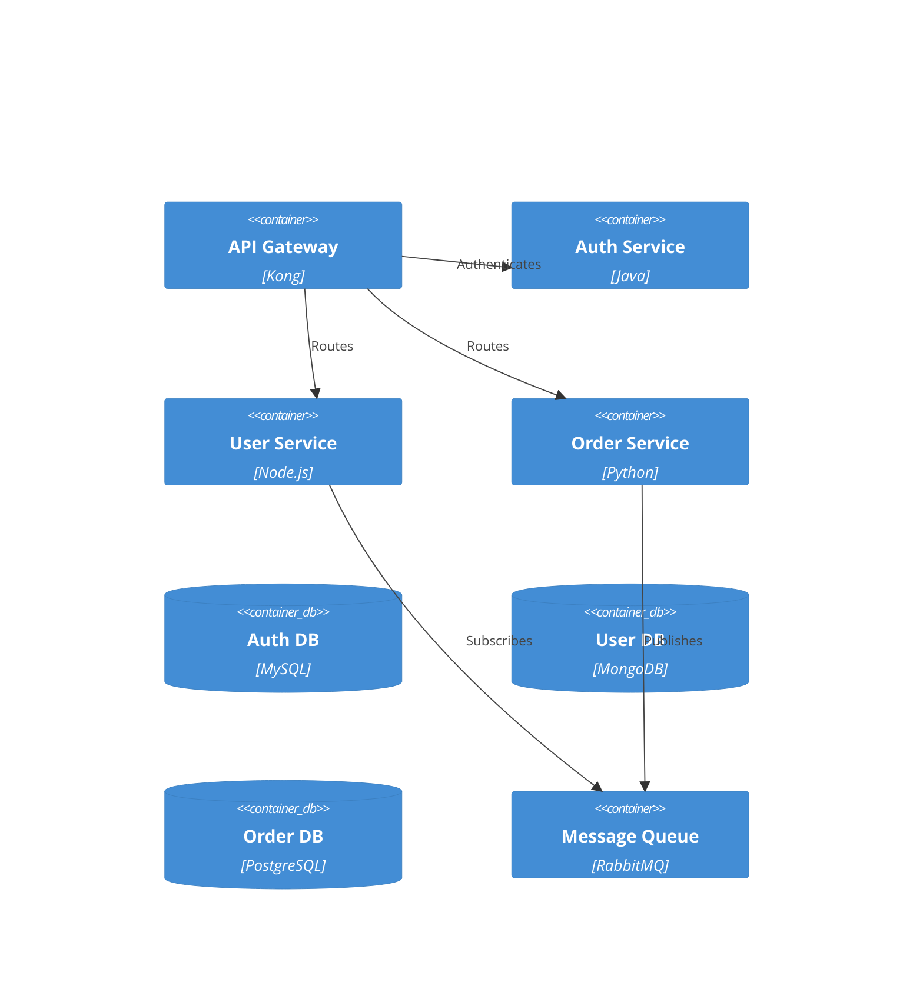

# Architecture Documentation & Extraction Guide

## Purpose
This guide directs Claude to analyze undocumented or poorly documented codebases and extract comprehensive architectural information, producing professional documentation including C4 diagrams, technical specifications, and solution architecture artifacts.

## Core Objectives

1. **Reverse-engineer architecture** from existing code
2. **Generate C4 model diagrams** (Context, Container, Component, Code)
3. **Document technical and solution architecture**
4. **Establish documentation standards** for the project
5. **Create maintainable, professional artifacts**

---

## Analysis Approach

### Phase 1: Repository Discovery & Inventory

When analyzing a codebase, systematically explore:

1. **Entry Points & Structure**
   - Main application files (main.py, index.js, Program.cs, etc.)
   - Configuration files (package.json, pom.xml, .env templates, docker-compose.yml)
   - Documentation files (README, CHANGELOG, /docs folder)
   - Build and deployment scripts

2. **Technology Stack Identification**
   - Programming languages and versions
   - Frameworks and libraries (check dependency files)
   - Databases and data stores
   - External services and APIs
   - Infrastructure components (Docker, K8s, cloud resources)

3. **Code Organization Patterns**
   - Project structure and module organization
   - Architectural patterns (MVC, microservices, layered, event-driven, etc.)
   - Design patterns in use
   - Separation of concerns

4. **Integration Points**
   - External API calls
   - Message queues and event buses
   - Database connections
   - Authentication/authorization mechanisms
   - Third-party service integrations

### Phase 2: Deep Analysis

Examine the codebase for:

1. **Data Flow & Processing**
   - How data enters the system
   - Transformation and processing steps
   - Data persistence strategies
   - Caching mechanisms

2. **Business Logic & Domain Model**
   - Core domain concepts and entities
   - Business rules and workflows
   - State management
   - Validation and business constraints

3. **Cross-Cutting Concerns**
   - Logging and monitoring
   - Error handling and resilience patterns
   - Security implementations
   - Performance optimizations

4. **Deployment & Infrastructure**
   - Deployment configurations
   - Environment management
   - Scalability considerations
   - Monitoring and observability setup

---

## C4 Model Documentation

Generate comprehensive C4 diagrams using Mermaid syntax. Create separate artifacts for each level.

### Level 1: System Context Diagram

**Purpose**: Show the system in the context of users and external systems.

**Elements to identify**:
- The system being documented (central box)
- Users/actors (people or roles)
- External systems the application interacts with
- High-level relationships and data flows

**Mermaid Template**:


### Level 2: Container Diagram

**Purpose**: Show high-level technology choices and how containers communicate.

**Containers are**:
- Web applications
- Mobile apps
- Desktop applications
- Databases
- File systems
- Microservices
- Serverless functions

**Mermaid Template**:


### Level 3: Component Diagram

**Purpose**: Decompose containers into components showing responsibilities.

**Components are**:
- Controllers/Handlers
- Services/Business Logic
- Repositories/Data Access
- Utilities/Helpers
- Middleware

**Mermaid Template**:


### Level 4: Code Diagram

**Purpose**: Show implementation details for specific components (UML class diagrams).

Use when additional detail is valuable for complex components. Can be represented with Mermaid class diagrams.

---

## Documentation Artifacts to Generate

### 1. Architecture Decision Records (ADRs)

For each significant architectural decision inferred from the code:

```markdown
# ADR-[NUMBER]: [Title]

## Status
[Proposed/Accepted/Deprecated/Superseded]

## Context
What is the issue we're trying to solve?

## Decision
What decision was made? (Inferred from implementation)

## Consequences
- Positive consequences
- Negative consequences
- Trade-offs made
```

### 2. System Overview Document

```markdown
# System Architecture Overview

## Executive Summary
Brief description of what the system does and its primary purpose.

## Architecture Style
- Overall architecture pattern (monolithic, microservices, serverless, etc.)
- Justification based on observed patterns

## Key Components
High-level breakdown of major components.

## Technology Stack
- Frontend: [Technologies]
- Backend: [Technologies]
- Data: [Technologies]
- Infrastructure: [Technologies]
- DevOps: [Technologies]

## Quality Attributes
- Performance characteristics
- Scalability approach
- Security measures
- Reliability/resilience patterns
```

### 3. Technical Architecture Document

```markdown
# Technical Architecture

## System Decomposition
Detailed breakdown of system components.

## Data Architecture
- Data models and schemas
- Data flow diagrams
- Storage strategies
- Caching strategies

## Integration Architecture
- External system integrations
- API contracts
- Message formats
- Authentication/authorization

## Infrastructure Architecture
- Deployment model
- Network topology
- Scaling strategy
- Disaster recovery

## Security Architecture
- Authentication mechanisms
- Authorization model
- Data protection
- Security controls
```

### 4. Component Catalog

```markdown
# Component Catalog

## [Component Name]

**Purpose**: What this component does

**Responsibilities**:
- Responsibility 1
- Responsibility 2

**Dependencies**:
- Internal: Components it depends on
- External: Third-party libraries/services

**Interfaces**:
- Public APIs/methods exposed
- Events published/consumed

**Data**: Data it owns or manages

**Notes**: Implementation details, patterns used
```

### 5. Data Dictionary

```markdown
# Data Dictionary

## [Entity/Table Name]

**Purpose**: Description of what this data represents

**Attributes**:
| Field | Type | Required | Description | Constraints |
|-------|------|----------|-------------|-------------|
| id | int | Yes | Unique identifier | Primary key |

**Relationships**:
- Related to [Entity] via [relationship]

**Indexes**: Performance indexes

**Notes**: Important implementation details
```

### 6. API Documentation

```markdown
# API Documentation

## Endpoint: [HTTP Method] [Path]

**Purpose**: What this endpoint does

**Authentication**: Requirements

**Request**:
- Headers
- Path parameters
- Query parameters
- Body schema

**Response**:
- Success (200): Schema
- Error cases: Status codes and schemas

**Example**:
```json
{
  "example": "request/response"
}
```

**Notes**: Implementation details, rate limits, etc.
```

### 7. Deployment Guide

```markdown
# Deployment Architecture

## Environments
- Development
- Staging
- Production

## Infrastructure Components
- Servers/compute
- Load balancers
- Databases
- Cache layers
- Message queues
- Storage

## Deployment Process
Step-by-step deployment procedure inferred from scripts and configuration.

## Configuration Management
Environment variables, secrets, feature flags.

## Monitoring & Observability
- Logging
- Metrics
- Alerting
- Tracing
```

---

## Documentation Quality Rubric

Use this rubric to evaluate and ensure high-quality documentation output.

### Completeness (25 points)

| Score | Criteria |
|-------|----------|
| 25 | All architecture levels documented (Context, Container, Component). All major components cataloged. Complete data models. Full integration points mapped. |
| 20 | Most architecture levels documented. Key components cataloged. Major data models present. Primary integrations mapped. |
| 15 | Basic architecture documented. Main components identified. Core data models present. |
| 10 | Minimal architecture documented. Some components identified. |
| 5 | Incomplete documentation with significant gaps. |

### Accuracy (25 points)

| Score | Criteria |
|-------|----------|
| 25 | All diagrams accurately reflect codebase. Technology stack correctly identified. Relationships and dependencies verified against code. |
| 20 | Diagrams mostly accurate with minor discrepancies. Technology stack correct. Most relationships verified. |
| 15 | Generally accurate with some errors. Core architecture correct. |
| 10 | Multiple inaccuracies. Some guesswork without verification. |
| 5 | Significant errors or misrepresentations. |

### Clarity (20 points)

| Score | Criteria |
|-------|----------|
| 20 | Crystal clear explanations. Consistent terminology. Appropriate detail level for audience. Diagrams are intuitive and well-labeled. |
| 16 | Clear explanations. Mostly consistent terminology. Appropriate detail. |
| 12 | Understandable but could be clearer. Some terminology inconsistencies. |
| 8 | Confusing in places. Inconsistent terminology. |
| 4 | Difficult to understand. Poor organization. |

### Professional Quality (15 points)

| Score | Criteria |
|-------|----------|
| 15 | Publication-ready. Consistent formatting. No typos. Professional diagrams. Follows documentation standards. |
| 12 | High quality. Minor formatting issues. Professional appearance. |
| 9 | Good quality. Some formatting inconsistencies. |
| 6 | Acceptable but unprofessional in places. |
| 3 | Poor quality. Many issues. |

### Usefulness (15 points)

| Score | Criteria |
|-------|----------|
| 15 | Immediately actionable. New team members could onboard with this. Answers all key questions. Provides context and rationale. |
| 12 | Very useful. Could onboard with minor additional info. Answers most questions. |
| 9 | Useful as reference. Some gaps for onboarding. |
| 6 | Limited usefulness. Significant gaps. |
| 3 | Minimally useful. Too many gaps. |

### Total Score: /100

**Grade Scale**:
- 90-100: Excellent
- 80-89: Good
- 70-79: Satisfactory
- 60-69: Needs Improvement
- Below 60: Unacceptable

---

## Workflow Instructions for Claude

When asked to analyze a repository and extract architecture:

1. **Initial Scan** (5-10 minutes)
   - Map directory structure
   - Identify entry points
   - List configuration files
   - Note technology stack

2. **Component Analysis** (15-20 minutes)
   - Examine main application code
   - Identify major components/modules
   - Map dependencies
   - Note design patterns

3. **Integration Analysis** (10-15 minutes)
   - Find external service calls
   - Identify database interactions
   - Map API endpoints
   - Note authentication flows

4. **Documentation Generation** (20-30 minutes)
   - Create C4 Context diagram
   - Create C4 Container diagram
   - Create C4 Component diagrams for key containers
   - Write System Overview
   - Write Technical Architecture
   - Create Component Catalog
   - Document APIs
   - Create Data Dictionary

5. **Review & Refinement** (10 minutes)
   - Verify accuracy against code
   - Ensure consistency
   - Check for completeness
   - Apply rubric scoring

### Output Format

Provide documentation as:
1. **Executive Summary** - 1 page overview
2. **Architecture Diagrams** - Separate Mermaid artifacts for each C4 level
3. **Technical Documentation** - Markdown documents for detailed architecture
4. **Component Catalog** - Reference documentation
5. **Self-Assessment** - Rubric scoring with justification

### Best Practices

- **Be Visual**: Prefer diagrams over text where possible
- **Be Specific**: Reference actual file names, class names, and technologies
- **Be Honest**: Note assumptions and areas of uncertainty
- **Be Structured**: Use consistent formatting and organization
- **Be Concise**: Avoid unnecessary verbosity
- **Be Actionable**: Documentation should enable decision-making

### Questions to Answer

Your analysis should answer:
- What does this system do?
- How is it structured?
- What technologies are used and why?
- How do components communicate?
- Where is data stored and how is it accessed?
- What are the external dependencies?
- How is it deployed?
- What are the key architectural decisions?
- What are the quality attributes (performance, security, scalability)?
- Where are the risks and technical debt?

---

## Example Analysis Output Structure

```
/architecture-docs/
├── README.md (Executive Summary)
├── diagrams/
│   ├── c4-context.mermaid
│   ├── c4-container.mermaid
│   ├── c4-component-api.mermaid
│   ├── c4-component-web.mermaid
│   └── data-flow.mermaid
├── architecture/
│   ├── system-overview.md
│   ├── technical-architecture.md
│   ├── solution-architecture.md
│   └── deployment-architecture.md
├── reference/
│   ├── component-catalog.md
│   ├── api-documentation.md
│   ├── data-dictionary.md
│   └── technology-stack.md
└── decisions/
    ├── adr-001-architecture-style.md
    ├── adr-002-database-choice.md
    └── adr-003-api-design.md
```

---

## Mermaid Diagram Best Practices

### General Guidelines
- Keep diagrams focused on one level of abstraction
- Use consistent naming conventions
- Add descriptions that add value
- Limit elements to 7-10 per diagram for readability
- Use boundaries to group related elements
- Choose appropriate relationships (uses, reads, writes, calls, sends)

### Styling Recommendations
```mermaid
%%{init: {'theme':'base', 'themeVariables': { 'primaryColor':'#1168bd','primaryTextColor':'#fff'}}}%%
```

### Common Patterns

**Web Application with Database**:


**Microservices Architecture**:


---

## Advanced Analysis Techniques

### Pattern Recognition

Look for common patterns in the code:

1. **Architectural Patterns**
   - Layered/N-tier (presentation, business, data layers)
   - Microservices (independent deployable services)
   - Event-driven (message queues, event sourcing)
   - CQRS (command query responsibility segregation)
   - Hexagonal/Clean Architecture (ports and adapters)

2. **Design Patterns**
   - Repository pattern (data access abstraction)
   - Factory pattern (object creation)
   - Strategy pattern (algorithm selection)
   - Observer pattern (event handling)
   - Dependency Injection (loose coupling)

3. **Integration Patterns**
   - REST APIs
   - GraphQL
   - Message queues
   - Event streaming
   - Service mesh

### Inference Techniques

When documentation is missing:

1. **Technology Stack**: Check package/dependency files first
2. **Architecture Style**: Examine project structure and module organization
3. **Data Models**: Analyze database migrations or ORM models
4. **API Contracts**: Look at routing files and controller signatures
5. **Business Logic**: Examine service layer and domain models
6. **Deployment**: Check Dockerfile, docker-compose, K8s manifests, CI/CD configs

### Validation Methods

- Cross-reference findings across multiple files
- Trace data flow from entry to storage
- Verify relationships by examining import/require statements
- Test inferences against actual code implementations
- Note confidence level for assumptions

---

## Handling Common Challenges

### Challenge: Large Codebase
**Solution**: Focus on main flows first, then expand. Create multiple component diagrams instead of one large diagram.

### Challenge: Mixed Patterns
**Solution**: Document the actual patterns used, note inconsistencies, recommend standardization.

### Challenge: Legacy Code
**Solution**: Document "as-is" architecture, note technical debt, suggest modernization paths.

### Challenge: Microservices Complexity
**Solution**: Create separate container diagrams for each service, plus an overall context diagram.

### Challenge: Poor Code Organization
**Solution**: Infer logical architecture from code execution flow, recommend restructuring.

### Challenge: Missing Configuration
**Solution**: Document what's found, note missing pieces, recommend configuration documentation.

---

## Success Criteria

Your documentation extraction is successful when:

✅ A new developer can understand the system in 1-2 hours
✅ All major components are identified and explained
✅ Technology choices are clear
✅ Integration points are mapped
✅ Data flows are documented
✅ Deployment process is understood
✅ Diagrams accurately reflect implementation
✅ Documentation scores 80+ on the rubric
✅ No major architectural elements are missing
✅ Assumptions are clearly stated

---

## Quick Reference: C4 Element Types

### Context Diagram
- `Person()` - User or actor
- `System()` - System being documented
- `System_Ext()` - External system
- `Rel()` - Relationship

### Container Diagram
- `Container()` - Application, service, or process
- `ContainerDb()` - Database
- `ContainerQueue()` - Message queue
- `Container_Boundary()` - Grouping
- `System_Ext()` - External system

### Component Diagram
- `Component()` - Code component
- `ComponentDb()` - Database
- `ComponentQueue()` - Queue
- `Component_Boundary()` - Container boundary

### Relationships
- `Rel()` - Generic relationship
- `Rel_Back()` - Reverse relationship
- `BiRel()` - Bidirectional relationship
- Parameters: (from, to, label, technology)

---

## Remember

- **Documentation is a living artifact** - it should evolve with the code
- **Accuracy over completeness** - correct information about core components is better than incomplete information about everything
- **Audience matters** - adjust technical depth based on who will read the documentation
- **Visual > Text** - a good diagram communicates faster than paragraphs
- **Context is king** - always explain the "why" behind architectural decisions

When in doubt, examine the code more deeply rather than making assumptions.
